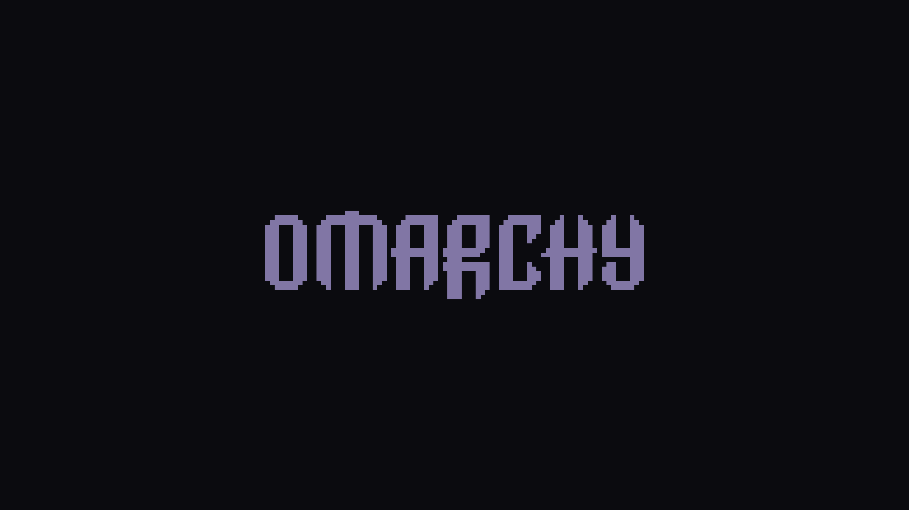

# SmokeyEmber

A restrained dark theme for [Omarchy](https://omarchy.org/) built from charcoal surfaces, muted lavender structure, and focused burnt-orange accents.



### 32:9 ultrawide variant

These versions are composed specifically for a 5120×1440 49-inch display rather than stretching or cropping the 16:9 artwork.


SmokeyEmber keeps Omarchy's native spacing, layout, and component behavior intact. Its identity comes from color: nearly black foundations, quiet purple borders, and small ember-orange points of focus.

## Core palette

| Role | Color |
| --- | --- |
| Primary background | `#0B0B0F` |
| Surface | `#121218` |
| Raised surface | `#191820` |
| Pearl foreground | `#C8C7D0` |
| Bright pearl | `#ECEAF1` |
| Muted lavender | `#8176A5` |
| Burnt orange | `#FF6B35` |
| Dark orange | `#D9572B` |
| Lavender | `#9D7CD8` |
| Focus lavender | `#A79ABD` |
| Border / selection | `#332F3D` |

## Supporting ANSI and syntax palette

These supporting colors give terminals, editor syntax, diffs, and status states clear separation without competing with the charcoal–lavender–orange identity.

| Semantic color | Normal | Bright | Primary use |
| --- | --- | --- | --- |
| Red | `#D9572B` | `#FF7A50` | Errors, removals, and ANSI red |
| Sage | `#87968B` | `#A7B1A8` | Strings, additions, success states, Fastfetch, and ANSI green |
| Warm amber | `#E89A5B` | `#FFB16E` | Types, warnings, and ANSI yellow |
| Slate blue | `#8396A6` | `#A4B0BD` | Properties, parameters, hints, moved diffs, and ANSI cyan |
| Periwinkle | `#7F8FBE` | `#9DACD2` | Functions, methods, information, links, and ANSI blue |
| Lavender | `#9D7CD8` | `#B89EE7` | Keywords, macros, and ANSI magenta |
| Ember orange | `#FF6B35` | — | Numbers, booleans, modified lines, and interaction accents |
| Brown | `#8C5742` | — | Additional syntax separation in Neovim |

All terminal and application configurations are generated from [`colors.toml`](./colors.toml), the single source of truth for the palette. The four sage and slate values have contrast ratios from 6.33:1 to 8.91:1 against `#0B0B0F`.

## Compatibility

SmokeyEmber targets the semantic theme format in Omarchy 4 and was built against Omarchy `4.0.0-1`.

Omarchy renders the source palette into its current integrations when the theme is applied:

- Hyprland window and group borders
- omarchy-shell bar, launcher, menus, notifications, OSD, and lock screen
- Kitty, Foot, Ghostty, and Alacritty
- Neovim and Helix
- btop
- VS Code, VSCodium, Cursor, Chromium, Obsidian, Claude, Pi, Gum, and keyboard RGB where available

Waybar, Walker, mako, and standalone hyprlock theme files are deliberately not included. Omarchy 4 provides those desktop surfaces through omarchy-shell/Quickshell, and `colors.toml` is their supported theme source.

Kitty, Foot, Ghostty, and Alacritty are all generated by Omarchy from the same semantic palette in `colors.toml`. This makes a local checkout behave the same as a theme installed from GitHub.

## Local preview

From the repository root, run:

```bash
./scripts/preview-local.sh
```

The script validates the project, creates a development symlink at `~/.config/omarchy/themes/smokeyember`, remembers the current theme, applies SmokeyEmber, and restores the previous theme when you press Enter or interrupt it.

It refuses to overwrite an existing theme directory or unrelated symlink.

## Local installation

Install the development checkout without applying it:

```bash
./scripts/install-local.sh
```

Then apply it explicitly:

```bash
omarchy theme set smokeyember
```

Return to another installed theme at any time:

```bash
omarchy theme set "Tokyo Night"
```

## Installation from GitHub

After publishing the repository, users can install and apply it with Omarchy's native installer:

```bash
omarchy theme install https://github.com/H0neyB4dgerr/omarchy-smokeyember-theme.git
```

The repository name is intentional: Omarchy strips the `omarchy-` prefix and `-theme` suffix, installing it under the `smokeyember` slug.

## Unlock screen

SmokeyEmber also appears in `Style → Unlock`. Its transparent 900×260 logo uses the official OMARCHY vector wordmark in focus lavender with a restrained ember-orange glow. The included 1920×1080 preview is composed with Omarchy's own Plymouth preview tool using the charcoal background and pearl controls.

Select it from `Style → Unlock` when you want to apply it. Installing or applying the desktop theme does not change the current unlock screen automatically, and no `shell.lock.toml` override is included: the desktop lock screen continues to use Omarchy's generated `[lock]` palette.

To reproduce both PNG assets after editing the SVG source:

```bash
./scripts/export-unlock.sh
```

The exporter requires `rsvg-convert`, ImageMagick, and `omarchy-plymouth-preview`.

## Wallpaper

The two editable SVG sources live in [`assets/wallpaper/`](./assets/wallpaper/): one 3840×2160 version and one 5120×1440 ultrawide version. Their wordmark uses the official vector geometry shipped by Omarchy and follows the compact scale of its stock wallpapers.

Both committed PNG files live in `backgrounds/`, so Omarchy automatically indexes them in the theme background carousel. Cycle between them with:

```bash
omarchy theme bg next
```

If the theme was already active while these files changed, reapply it once with `omarchy theme set smokeyember` so Omarchy refreshes its current-theme copy and carousel cache.

### Multi-monitor behavior

Omarchy 4 currently keeps one global `current/background` link. Its Quickshell background plugin creates a surface for every display, but every surface reads that same image and uses proportional cropping. A portable theme therefore cannot assign a different wallpaper to each monitor or choose an aspect ratio per output automatically.

Both aspect-ratio variants remain available in the carousel for manual selection. True simultaneous per-monitor selection would require a separate user-level omarchy-shell plugin customization and per-output background state; it is intentionally not bundled into this theme.

To regenerate both PNG files after editing the SVG sources:

```bash
./scripts/export-wallpaper.sh
```

The export script requires `rsvg-convert` from `librsvg`; it is only needed when changing the wallpaper, not when using the theme.

## Validation

Run the non-destructive checks with:

```bash
./scripts/validate.sh
```

Validation checks exact palette values, shell scripts, SVG sources, PNG dimensions and transparency, regular-file safety for both Unlock PNGs, the icon theme, and Omarchy's resolution of every required semantic color.

## Screenshots

Real screenshots can be added later at these stable paths:

- `screenshots/desktop.png`
- `screenshots/launcher.png`
- `screenshots/terminal-nvim.png`

See [`screenshots/README.md`](./screenshots/README.md) for the capture notes.

## Project structure

```text
.
├── colors.toml                  # Semantic Omarchy palette
├── icons.theme                  # Yaru-purple icon integration
├── unlock.png                   # Transparent Plymouth/SDDM wordmark
├── preview-unlock.png           # Style → Unlock selector preview
├── backgrounds/                 # Raster backgrounds selected by Omarchy
├── assets/                      # Editable wallpaper and unlock SVG sources
├── docs/                         # Design decisions and resume context
├── screenshots/                 # Stable paths for real captures
└── scripts/                     # Export, validation, install, and preview helpers
```

Generated shell, editor, application, and terminal configs are not committed. Omarchy creates all of them from `colors.toml` using the templates shipped by the installed version, which keeps local and GitHub installations consistent and forward-compatible.

## Concept

Smoke supplies the depth; lavender supplies the structure; ember orange marks attention. The result is technical and modern without becoming neon or visually noisy.

## Development context

The current visual decisions, measured wallpaper geometry, Omarchy constraints, resume workflow, and next-iteration ideas are recorded in [`docs/DESIGN-NOTES.md`](./docs/DESIGN-NOTES.md).

## License

SmokeyEmber is released under the [MIT License](./LICENSE).
